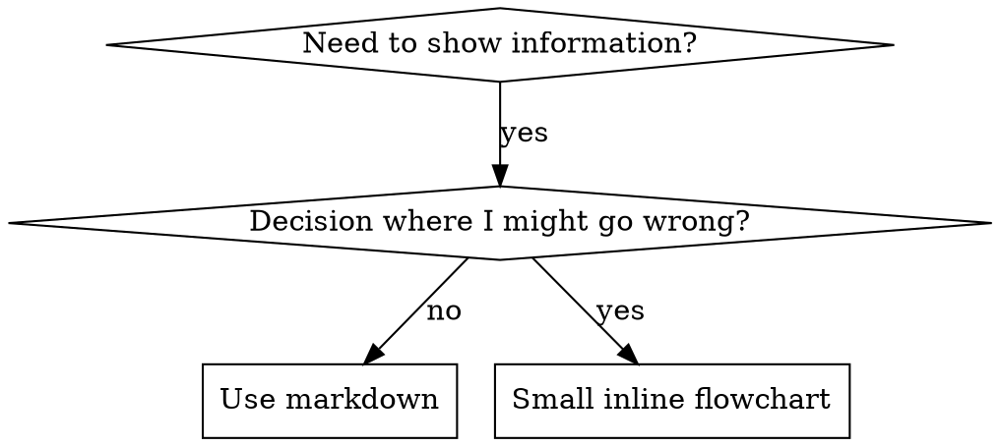

# Writing Skills

## Overview

**Writing skills IS Test-Driven Development applied to process documentation.**

**All skills live in `~/ai/skills/` (the git repo root)**

You write test cases (pressure scenarios with subagents), watch them fail (baseline behavior), write the skill (documentation), watch tests pass (agents comply), and refactor (close loopholes).

**Core principle:** If you didn't watch an agent fail without the skill, you don't know if the skill teaches the right thing.

**REQUIRED BACKGROUND:** You MUST understand high-quality testing standards (Iron Law of TDD) before using this skill. This skill adapts TDD to documentation.

**Official guidance:** For Anthropic's official skill authoring best practices, see anthropic-best-practices.md. This document provides additional patterns and guidelines that complement the TDD-focused approach in this skill.

## What is a Skill?

A **skill** is a reference guide for proven techniques, patterns, or tools. Skills help future Claude instances find and apply effective approaches.

**Skills are:** Reusable techniques, patterns, tools, reference guides

**Skills are NOT:** Narratives about how you solved a problem once

### What Skills Provide

1. Specialized workflows - Multi-step procedures for specific domains
2. Tool integrations - Instructions for working with specific file formats or APIs
3. Domain expertise - Specialized knowledge, schemas, and context for knowledge-based work and "outlier" data outside typical LLM training distributions
4. Bundled resources - Scripts, references, and assets for complex and repetitive tasks

### Degrees of Freedom

Match the level of specificity to the task's fragility and variability:

**High freedom (text-based instructions)**: Use when multiple approaches are valid, decisions depend on context, or heuristics guide the approach.

**Medium freedom (pseudocode or scripts with parameters)**: Use when a preferred pattern exists, some variation is acceptable, or configuration affects behavior.

**Low freedom (specific scripts, few parameters)**: Use when operations are fragile and error-prone, consistency is critical, or a specific sequence must be followed.

Think of the agent as exploring a path: a narrow bridge with cliffs needs specific guardrails (low freedom), while an open field allows many routes (high freedom).

## TDD Mapping for Skills

| TDD Concept             | Skill Creation                                   |
| ----------------------- | ------------------------------------------------ |
| **Test case**           | Pressure scenario with subagent                  |
| **Production code**     | Skill document (SKILL.md)                        |
| **Test fails (RED)**    | Agent violates rule without skill (baseline)     |
| **Test passes (GREEN)** | Agent complies with skill present                |
| **Refactor**            | Close loopholes while maintaining compliance     |
| **Write test first**    | Run baseline scenario BEFORE writing skill       |
| **Watch it fail**       | Document exact rationalizations agent uses       |
| **Minimal code**        | Write skill addressing those specific violations |
| **Watch it pass**       | Verify agent now complies                        |
| **Refactor cycle**      | Find new rationalizations → plug → re-verify     |

The entire skill creation process follows RED-GREEN-REFACTOR.

## When to Create a Skill

**Create when:**

- Technique wasn't intuitively obvious to you
- You'd reference this again across projects
- Pattern applies broadly (not project-specific)
- Others would benefit

**Don't create for:**

- One-off solutions
- Standard practices well-documented elsewhere
- Project-specific conventions (put in CLAUDE.md)
- Mechanical constraints (if it's enforceable with regex/validation, automate it—save documentation for judgment calls)

## BEFORE Writing: Skill Harmony Check

**MANDATORY: Before writing ANY new skill, you MUST:**

### 1. Search Existing Skills

**First, search locally:**

```bash
# Check for related skills
ls ~/ai/skills/
grep -r "keyword" ~/ai/skills/*/SKILL.md
```

**Then, search LobeHub Marketplace:**

```bash
npx -y @lobehub/market-cli skills search --q "your topic"
```

Look for:

- Skills that already cover your topic (consider editing/extending instead)
- Skills that cover related topics to build off of
- Similar skills to use as a template

**Building off existing skills is preferred over creating from scratch.**

Ask:

- Does a skill already cover this topic?
- Does a skill cover a related topic that should be extended instead?
- Would this new skill duplicate or conflict with existing guidance?

### 2. Identify Cross-References

List ALL skills that relate to your topic:

- Skills that provide background concepts
- Skills that provide related techniques
- Skills that your new skill will reference

**Example:** Writing a "repo-steward-maintenance" skill:

- References: `Code Quality` (code quality standards)
- References: `Test Guidelines` (test standards)
- References: `systematic-debugging` (bug investigation)
- References: `Repo Explorer` (architectural patterns search)

### 3. Avoid Conflicting Directives

**Check for conflicts with existing skills:**

| Existing Skill Says | Your New Skill Must NOT                         |
| ------------------- | ----------------------------------------------- |
| "Always do X first" | "Start with Y"                                  |
| "Never use Z"       | "Use Z for..."                                  |
| "Follow pattern A"  | "Use pattern B" (unless explicitly contrasting) |

**If conflict found:**

1. Either extend the existing skill
2. Or explicitly explain when to use which approach
3. NEVER let agents discover conflicting guidance

### 4. Centralize Topic Directives (DRY)

**One topic = One source of truth**

| Topic                  | Skill                         |
| ---------------------- | ----------------------------- |
| Code quality standards | `Code Quality`                |
| Test quality standards | `Test Guidelines`             |
| Bug investigation      | `systematic-debugging`        |
| Refactoring patterns   | `Refactorer`                  |
| TDD methodology        | **Test Guidelines standards** |

**When writing about a topic:**

- If topic has a dedicated skill → reference it, don't restate
- If your skill needs that guidance → `**See: skill-name**`
- NEVER copy-paste guidance from one skill to another

**Why this matters:**

- Guidance in multiple places becomes stale
- Agents see conflicting versions
- Updates must be made in N places
- Centralized = version-controlled = maintained

### 5. Cross-Reference Format

```markdown
## Reference Skills

This skill builds on:

- **Code Quality** — Code quality standards (use for detecting code smells)
- **Test Guidelines** — Test quality standards (use for test audits)
- **systematic-debugging** — Bug investigation methodology
- **subagent-delegation** — Multi-agent orchestration

**REQUIRED BACKGROUND:** Load `systematic-debugging` before using this skill.
```

## Skill Types

### Technique

Concrete method with steps to follow (condition-based-waiting, root-cause-tracing)

### Pattern

Way of thinking about problems (flatten-with-flags, test-invariants)

### Reference

API docs, syntax guides, tool documentation (office docs)

## Directory Structure & Skill Anatomy

**Flat namespace** — all skills live in `~/ai/skills/` (the git repo root), one searchable namespace. This directory is symlinked into all harness-specific skill directories (e.g., `~/.agents/skills/`, `.claude/skills/`, `.cursor/skills/`) so a single skill is discoverable by any agent harness.

Every skill consists of a required SKILL.md file and optional bundled resources:

```
skill-name/
├── SKILL.md (required)
│   ├── YAML frontmatter metadata (required)
│   │   ├── name: (required)
│   │   └── description: (required)
│   └── Markdown instructions (required)
├── agents/ (recommended)
│   └── openai.yaml - UI metadata for skill lists and chips
└── Bundled Resources (optional)
    ├── scripts/          - Executable code (Python/Bash/etc.)
    ├── references/       - Documentation intended to be loaded into context as needed
    └── assets/           - Files used in output (templates, icons, fonts, etc.)
```

### SKILL.md (required)

Every SKILL.md consists of:

- **Frontmatter** (YAML): Contains `name` and `description` fields. These are the only fields that the agent reads to determine when the skill gets used. The `description` is loaded into context for _every_ conversation, so it must balance being concise (to avoid wasting tokens) with being verbose enough that the agent reliably triggers the skill. Aim for specific, concrete triggers in the fewest words possible.
- **Body** (Markdown): The skill body is what gets loaded into context after the skill triggers — a just-in-time prompt injection. These aren't limited to particular workflows; a skill body can contain _any_ kind of knowledge you want available on demand: API references, mathematical definitions, procedural checklists, coding conventions, domain terminology, or anything else that benefits from JIT loading rather than occupying context permanently.

### Scripts (`scripts/`)

Executable code (Python/Bash/etc.) for tasks that require deterministic reliability or are repeatedly rewritten.

**Prefer external tools first.** When possible, rely on no-install/no-config methods like `uvx` or `npx` to invoke existing, version-controlled, and independently tested tools. Local scripts in `scripts/` are "hidden" away in the skill tree with no tracking or version control of their own. Include local scripts only for highly specialized workflows with no existing external tool. If a local script grows sufficiently complex, refactor it into its own git repo and expose it via `npx`/`uvx` with progressive-discovery CLI help (e.g., Typer with subcommands and `--help`).

- **When to include**: When the same code is being rewritten repeatedly or deterministic reliability is needed
- **Example**: `scripts/rotate_pdf.py` for PDF rotation tasks
- **Benefits**: Token efficient, deterministic, may be executed without loading into context
- **Note**: Scripts may still need to be read for patching or environment-specific adjustments

### References (`references/`)

Documentation and reference material intended to be loaded as needed into context.

- **When to include**: For documentation that should be referenced while working
- **Examples**: `references/finance.md` for financial schemas, `references/api_docs.md` for API specifications
- **Benefits**: Keeps SKILL.md lean, loaded only when needed
- **Best practice**: If files are large (>10k words), include grep search patterns in SKILL.md
- **Avoid duplication**: Keep only essential procedural instructions in SKILL.md; move detailed reference material, schemas, and examples to references files.

### Assets (`assets/`)

Files not intended to be loaded into context, but rather used within the output produced.

- **When to include**: When the skill needs files that will be used in the final output
- **Examples**: `assets/logo.png`, `assets/slides.pptx`, `assets/frontend-template/`
- **Benefits**: Separates output resources from documentation

### What to NOT Include

A skill should only contain essential files that directly support its functionality. Do NOT create extraneous documentation:

- README.md
- INSTALLATION_GUIDE.md
- QUICK_REFERENCE.md
- CHANGELOG.md

The skill should only contain the information needed for an AI agent to do the job at hand. No auxiliary context about creation process, setup procedures, or user-facing documentation.

### Separating vs. Keeping Inline

**Separate files for:**

1. Heavy reference (100+ lines) — API docs, comprehensive syntax
2. Reusable tools — Scripts, utilities, templates

**Keep inline:**

- Principles and concepts
- Code patterns (< 50 lines)
- Everything else

## SKILL.md Structure

**Frontmatter (YAML):**

- Only two fields supported: `name` and `description`
- Max 1024 characters total
- `name`: Use letters, numbers, and hyphens only (no parentheses, special chars)
- `description`: Third-person, describes ONLY when to use (NOT what it does)
  - Start with "Use when..." to focus on triggering conditions
  - Include specific symptoms, situations, and contexts
  - **NEVER summarize the skill's process or workflow** (see CSO section for why)
  - Keep under 500 characters if possible

```markdown
---
name: Skill-Name-With-Hyphens
description: Use when [specific triggering conditions and symptoms]
---

# Skill Name

## Overview

What is this? Core principle in 1-2 sentences.

## Core Pattern (for techniques/patterns)

Before/after code comparison

## Quick Reference

Table or bullets for scanning common operations

## Implementation

Inline code for simple patterns
Link to file for heavy reference or reusable tools

## Common Mistakes

What goes wrong + fixes

## Real-World Impact (optional)

Concrete results
```

**Do not include a "When to Use" section in the skill body.** That content belongs in the `description` frontmatter — it is the trigger that causes the skill to be loaded. By the time the body is read, the agent is already using the skill; anything in a "When to Use" section is read too late to be a trigger and is redundant with what the description already states. Move triggering conditions to the description; do not simply delete them.

## Progressive Disclosure

Skills use a three-level loading system to manage context efficiently:

1. **Metadata (name + description)** — Always in context (~100 words)
2. **SKILL.md body** — When skill triggers (<5k words)
3. **Bundled resources** — As needed (scripts can execute without loading into context window)

### Progressive Disclosure Patterns

Keep SKILL.md body to the essentials and under 500 lines to minimize context bloat. Split content into separate files when approaching this limit. When splitting, reference them from SKILL.md and describe clearly when to read them. **Cross-reference and hyperlink explicitly** so the agent can follow what's needed for progressive disclosure — use relative markdown links like `[See FORMS.md](FORMS.md)` and state the triggering condition for loading each reference.

**Key principle:** When a skill supports multiple variations, frameworks, or options, keep only the core workflow and selection guidance in SKILL.md. Move variant-specific details into separate reference files.

**Pattern 1: High-level guide with references**

```markdown
# PDF Processing

## Quick start

Extract text with pdfplumber:
[code example]

## Advanced features

- **Form filling**: See [FORMS.md](FORMS.md) for complete guide
- **API reference**: See [REFERENCE.md](REFERENCE.md) for all methods
- **Examples**: See [EXAMPLES.md](EXAMPLES.md) for common patterns
```

FORMS.md, REFERENCE.md, and EXAMPLES.md are loaded only when needed.

**Pattern 2: Domain-specific organization**

For skills with multiple domains, organize by domain to avoid loading irrelevant context:

```
computation-algebra-skill/
├── SKILL.md (overview and navigation)
└── reference/
    ├── number-theory.md (primality, factorization, modular arithmetic)
    ├── algebraic-geometry.md (varieties, schemes, Gröbner bases)
    ├── representation-theory.md (Lie groups, character tables)
    └── combinatorics.md (partitions, generating functions)
```

When a task involves Gröbner bases, only algebraic-geometry.md is read.

Similarly, for skills supporting multiple frameworks, organize by variant:

```
cloud-deploy/
├── SKILL.md (workflow + provider selection)
└── references/
    ├── aws.md (AWS deployment patterns)
    ├── gcp.md (GCP deployment patterns)
    └── azure.md (Azure deployment patterns)
```

**Pattern 3: Conditional details**

Show basic content, link to advanced content:

```markdown
# DOCX Processing

## Creating documents

Use docx-js for new documents. See [DOCX-JS.md](DOCX-JS.md).

## Editing documents

For simple edits, modify the XML directly.

**For tracked changes**: See [REDLINING.md](REDLINING.md)
**For OOXML details**: See [OOXML.md](OOXML.md)
```

**Important guidelines:**

- **Avoid deeply nested references** — Keep references one level deep from SKILL.md. All reference files should link directly from SKILL.md.
- **Structure longer reference files** — For files longer than 100 lines, include a table of contents at the top.

## Claude Search Optimization (CSO)

**Critical for discovery:** Future Claude needs to FIND your skill

### 1. Rich Description Field

**Purpose:** Claude reads description to decide which skills to load for a given task. Make it answer: "Should I read this skill right now?"

**Format:** Start with "Use when..." to focus on triggering conditions

**CRITICAL: Description = When to Use, NOT What the Skill Does**

The description should ONLY describe triggering conditions. Do NOT summarize the skill's process or workflow in the description.

**Why this matters:** Testing revealed that when a description summarizes the skill's workflow, Claude may follow the description instead of reading the full skill content. A description saying "code review between tasks" caused Claude to do ONE review, even though the skill's flowchart clearly showed TWO reviews (spec compliance then code quality).

When the description was changed to just "Use when executing implementation plans with independent tasks" (no workflow summary), Claude correctly read the flowchart and followed the two-stage review process.

**The trap:** Descriptions that summarize workflow create a shortcut Claude will take. The skill body becomes documentation Claude skips.

```yaml
# ❌ BAD: Summarizes workflow - Claude may follow this instead of reading skill
description: Use when executing plans - dispatches subagent per task with code review between tasks

# ❌ BAD: Too much process detail
description: Use for TDD - write test first, watch it fail, write minimal code, refactor

# ✅ GOOD: Just triggering conditions, no workflow summary
description: Use when executing implementation plans with independent tasks in the current session

# ✅ GOOD: Triggering conditions only
description: Use when implementing any feature or bugfix, before writing implementation code
```

**Content:**

- Use concrete triggers, symptoms, and situations that signal this skill applies
- Describe the _problem_ (race conditions, inconsistent behavior) not _language-specific symptoms_ (setTimeout, sleep)
- Keep triggers technology-agnostic unless the skill itself is technology-specific
- If skill is technology-specific, make that explicit in the trigger
- Write in third person (injected into system prompt)
- **NEVER summarize the skill's process or workflow**

```yaml
# ❌ BAD: Too abstract, vague, doesn't include when to use
description: For async testing

# ❌ BAD: First person
description: I can help you with async tests when they're flaky

# ❌ BAD: Mentions technology but skill isn't specific to it
description: Use when tests use setTimeout/sleep and are flaky

# ✅ GOOD: Starts with "Use when", describes problem, no workflow
description: Use when tests have race conditions, timing dependencies, or pass/fail inconsistently

# ✅ GOOD: Technology-specific skill with explicit trigger
description: Use when using React Router and handling authentication redirects
```

### 2. Keyword Coverage

Use words Claude would search for:

- Error messages: "Hook timed out", "ENOTEMPTY", "race condition"
- Symptoms: "flaky", "hanging", "zombie", "pollution"
- Synonyms: "timeout/hang/freeze", "cleanup/teardown/afterEach"
- Tools: Actual commands, library names, file types

### 3. Descriptive Naming

**Use active voice, verb-first:**

- ✅ `creating-skills` not `skill-creation`
- ✅ `condition-based-waiting` not `async-test-helpers`

### 4. Token Efficiency (Critical)

**Problem:** getting-started and frequently-referenced skills load into EVERY conversation. Every token counts.

**Target word counts:**

- getting-started workflows: <150 words each
- Frequently-loaded skills: <200 words total
- Other skills: <500 words (still be concise)

**Techniques:**

**Move details to tool help:**

```bash
# ❌ BAD: Document all flags in SKILL.md
search-conversations supports --text, --both, --after DATE, --before DATE, --limit N

# ✅ GOOD: Reference --help
search-conversations supports multiple modes and filters. Run --help for details.
```

**Use cross-references:**

```markdown
# ❌ BAD: Repeat workflow details

When searching, dispatch subagent with template...
[20 lines of repeated instructions]

# ✅ GOOD: Reference other skill

Always use subagents (50-100x context savings). REQUIRED: Use `subagent-delegation` for workflow.
```

**Compress examples:**

```markdown
# ❌ BAD: Verbose example (42 words)

your human partner: "How did we handle authentication errors in React Router before?"
You: I'll search past conversations for React Router authentication patterns.
[Dispatch subagent with search query: "React Router authentication error handling 401"]

# ✅ GOOD: Minimal example (20 words)

Partner: "How did we handle auth errors in React Router?"
You: Searching...
[Dispatch subagent → synthesis]
```

**Eliminate redundancy:**

- Don't repeat what's in cross-referenced skills
- Don't explain what's obvious from command
- Don't include multiple examples of same pattern

**Verification:**

```bash
wc -w skills/path/SKILL.md
# getting-started workflows: aim for <150 each
# Other frequently-loaded: aim for <200 total
```

**Name by what you DO or core insight:**

- ✅ `condition-based-waiting` > `async-test-helpers`
- ✅ `using-skills` not `skill-usage`
- ✅ `flatten-with-flags` > `data-structure-refactoring`
- ✅ `root-cause-tracing` > `debugging-techniques`

**Gerunds (-ing) work well for processes:**

- `creating-skills`, `testing-skills`, `debugging-with-logs`
- Active, describes the action you're taking

### 4. Cross-Referencing Other Skills

**When writing documentation that references other skills:**

Use skill name only, with explicit requirement markers:

- ✅ Good: `**REQUIRED SUB-SKILL:** Use high-quality testing standards (TDD)`
- ✅ Good: `**REQUIRED BACKGROUND:** You MUST understand superpowers:systematic-debugging`
- ❌ Bad: `See skills/testing/test-driven-development` (unclear if required)
- ❌ Bad: `@skills/testing/test-driven-development/SKILL.md` (force-loads, burns context)

**Why no @ links:** `@` syntax force-loads files immediately, consuming 200k+ context before you need them.

## Flowchart Usage



**Use flowcharts ONLY for:**

- Non-obvious decision points
- Process loops where you might stop too early
- "When to use A vs B" decisions

**Never use flowcharts for:**

- Reference material → Tables, lists
- Code examples → Markdown blocks
- Linear instructions → Numbered lists
- Labels without semantic meaning (step1, helper2)

See @graphviz-conventions.dot for graphviz style rules.

**Visualizing for your human partner:** Use `render-graphs.js` in this directory to render a skill's flowcharts to SVG:

```bash
./render-graphs.js ../some-skill           # Each diagram separately
./render-graphs.js ../some-skill --combine # All diagrams in one SVG
```

## Code Examples

**One excellent example beats many mediocre ones**

Choose most relevant language:

- Testing techniques → TypeScript/JavaScript
- System debugging → Shell/Python
- Data processing → Python

**Good example:**

- Complete and runnable
- Well-commented explaining WHY
- From real scenario
- Shows pattern clearly
- Ready to adapt (not generic template)

**Don't:**

- Implement in 5+ languages
- Create fill-in-the-blank templates
- Write contrived examples

You're good at porting - one great example is enough.

## File Organization

### Self-Contained Skill

```
defense-in-depth/
  SKILL.md    # Everything inline
```

When: All content fits, no heavy reference needed

### Skill with Reusable Tool

```
condition-based-waiting/
  SKILL.md    # Overview + patterns
  example.ts  # Working helpers to adapt
```

When: Tool is reusable code, not just narrative

### Skill with Heavy Reference

```
pptx/
  SKILL.md       # Overview + workflows
  pptxgenjs.md   # 600 lines API reference
  ooxml.md       # 500 lines XML structure
  scripts/       # Executable tools
```

When: Reference material too large for inline

## The Iron Law (TDD)

```
NO SKILL WITHOUT A FAILING TEST FIRST
```

This applies to NEW skills AND EDITS to existing skills.

Write skill before testing? Delete it. Start over.
Edit skill without testing? Same violation.

**No exceptions:**

- Not for "simple additions"
- Not for "just adding a section"
- Not for "documentation updates"
- Don't keep untested changes as "reference"
- Don't "adapt" while running tests
- Delete means delete

**REQUIRED BACKGROUND:** The high-quality testing standards (Iron Law of TDD) explains why this matters. Same principles apply to documentation.

## Testing All Skill Types

Different skill types need different test approaches:

### Discipline-Enforcing Skills (rules/requirements)

**Examples:** TDD, Verification Evidence, Code Quality audits

**Test with:**

- Academic questions: Do they understand the rules?
- Pressure scenarios: Do they comply under stress?
- Multiple pressures combined: time + sunk cost + exhaustion
- Identify rationalizations and add explicit counters

**Success criteria:** Agent follows rule under maximum pressure

### Technique Skills (how-to guides)

**Examples:** condition-based-waiting, root-cause-tracing, defensive-programming

**Test with:**

- Application scenarios: Can they apply the technique correctly?
- Variation scenarios: Do they handle edge cases?
- Missing information tests: Do instructions have gaps?

**Success criteria:** Agent successfully applies technique to new scenario

### Pattern Skills (mental models)

**Examples:** reducing-complexity, information-hiding concepts

**Test with:**

- Recognition scenarios: Do they recognize when pattern applies?
- Application scenarios: Can they use the mental model?
- Counter-examples: Do they know when NOT to apply?

**Success criteria:** Agent correctly identifies when/how to apply pattern

### Reference Skills (documentation/APIs)

**Examples:** API documentation, command references, library guides

**Test with:**

- Retrieval scenarios: Can they find the right information?
- Application scenarios: Can they use what they found correctly?
- Gap testing: Are common use cases covered?

**Success criteria:** Agent finds and correctly applies reference information

## Common Rationalizations for Skipping Testing

| Excuse                         | Reality                                                          |
| ------------------------------ | ---------------------------------------------------------------- |
| "Skill is obviously clear"     | Clear to you ≠ clear to other agents. Test it.                   |
| "It's just a reference"        | References can have gaps, unclear sections. Test retrieval.      |
| "Testing is overkill"          | Untested skills have issues. Always. 15 min testing saves hours. |
| "I'll test if problems emerge" | Problems = agents can't use skill. Test BEFORE deploying.        |
| "Too tedious to test"          | Testing is less tedious than debugging bad skill in production.  |
| "I'm confident it's good"      | Overconfidence guarantees issues. Test anyway.                   |
| "Academic review is enough"    | Reading ≠ using. Test application scenarios.                     |
| "No time to test"              | Deploying untested skill wastes more time fixing it later.       |

**All of these mean: Test before deploying. No exceptions.**

## Bulletproofing Skills Against Rationalization

Skills that enforce discipline (like TDD) need to resist rationalization. Agents are smart and will find loopholes when under pressure.

**Psychology note:** Understanding WHY persuasion techniques work helps you apply them systematically. See persuasion-principles.md for research foundation (Cialdini, 2021; Meincke et al., 2025) on authority, commitment, scarcity, social proof, and unity principles.

### Close Every Loophole Explicitly

Don't just state the rule - forbid specific workarounds:

<Bad>
```markdown
Write code before test? Delete it.
```
</Bad>

<Good>
```markdown
Write code before test? Delete it. Start over.

**No exceptions:**

- Don't keep it as "reference"
- Don't "adapt" it while writing tests
- Don't look at it
- Delete means delete

````
</Good>

### Address "Spirit vs Letter" Arguments

Add foundational principle early:

```markdown
**Violating the letter of the rules is violating the spirit of the rules.**
````

This cuts off entire class of "I'm following the spirit" rationalizations.

### Build Rationalization Table

Capture rationalizations from baseline testing (see Testing section below). Every excuse agents make goes in the table:

```markdown
| Excuse                           | Reality                                                                 |
| -------------------------------- | ----------------------------------------------------------------------- |
| "Too simple to test"             | Simple code breaks. Test takes 30 seconds.                              |
| "I'll test after"                | Tests passing immediately prove nothing.                                |
| "Tests after achieve same goals" | Tests-after = "what does this do?" Tests-first = "what should this do?" |
```

### Create Red Flags List

Make it easy for agents to self-check when rationalizing:

```markdown
## Red Flags - STOP and Start Over

- Code before test
- "I already manually tested it"
- "Tests after achieve the same purpose"
- "It's about spirit not ritual"
- "This is different because..."

**All of these mean: Delete code. Start over with TDD.**
```

### Update CSO for Violation Symptoms

Add to description: symptoms of when you're ABOUT to violate the rule:

```yaml
description: use when implementing any feature or bugfix, before writing implementation code
```

## RED-GREEN-REFACTOR for Skills

Follow the TDD cycle:

### RED: Write Failing Test (Baseline)

Run pressure scenario with subagent WITHOUT the skill. Document exact behavior:

- What choices did they make?
- What rationalizations did they use (verbatim)?
- Which pressures triggered violations?

This is "watch the test fail" - you must see what agents naturally do before writing the skill.

### GREEN: Write Minimal Skill

Write skill that addresses those specific rationalizations. Don't add extra content for hypothetical cases.

Run same scenarios WITH skill. Agent should now comply.

### REFACTOR: Close Loopholes

Agent found new rationalization? Add explicit counter. Re-test until bulletproof.

**Testing methodology:** See @testing-skills-with-subagents.md for the complete testing methodology:

- How to write pressure scenarios
- Pressure types (time, sunk cost, authority, exhaustion)
- Plugging holes systematically
- Meta-testing techniques

## Anti-Patterns

### ❌ Narrative Example

"In session 2025-10-03, we found empty projectDir caused..."
**Why bad:** Too specific, not reusable

### ❌ Multi-Language Dilution

example-js.js, example-py.py, example-go.go
**Why bad:** Mediocre quality, maintenance burden

### ❌ Code in Flowcharts

```dot
step1 [label="import fs"];
step2 [label="read file"];
```

**Why bad:** Can't copy-paste, hard to read

### ❌ Generic Labels

helper1, helper2, step3, pattern4
**Why bad:** Labels should have semantic meaning

## STOP: Before Moving to Next Skill

**After writing ANY skill, you MUST STOP and complete the deployment process.**

**Do NOT:**

- Create multiple skills in batch without testing each
- Move to next skill before current one is verified
- Skip testing because "batching is more efficient"

**The deployment checklist below is MANDATORY for EACH skill.**

Deploying untested skills = deploying untested code. It's a violation of quality standards.

## Skill Creation Checklist (TDD Adapted)

**IMPORTANT: Use TodoWrite to create todos for EACH checklist item below.**

**RED Phase - Write Failing Test:**

- [ ] Create pressure scenarios (3+ combined pressures for discipline skills)
- [ ] Run scenarios WITHOUT skill - document baseline behavior verbatim
- [ ] Identify patterns in rationalizations/failures

**GREEN Phase - Write Minimal Skill:**

- [ ] Name uses only letters, numbers, hyphens (no parentheses/special chars)
- [ ] YAML frontmatter with only name and description (max 1024 chars)
- [ ] Description starts with "Use when..." and includes specific triggers/symptoms
- [ ] Description written in third person
- [ ] Keywords throughout for search (errors, symptoms, tools)
- [ ] Clear overview with core principle
- [ ] Address specific baseline failures identified in RED
- [ ] Code inline OR link to separate file
- [ ] One excellent example (not multi-language)
- [ ] Run scenarios WITH skill - verify agents now comply

**REFACTOR Phase - Close Loopholes:**

- [ ] Identify NEW rationalizations from testing
- [ ] Add explicit counters (if discipline skill)
- [ ] Build rationalization table from all test iterations
- [ ] Create red flags list
- [ ] Re-test until bulletproof

**Quality Checks:**

- [ ] Small flowchart only if decision non-obvious
- [ ] Quick reference table
- [ ] Common mistakes section
- [ ] No narrative storytelling
- [ ] Supporting files only for tools or heavy reference

**Deployment:**

- [ ] Commit skill to git and push to your fork (if configured)
- [ ] Consider contributing back via PR (if broadly useful)

## Discovery Workflow

How future Claude finds your skill:

1. **Encounters problem** ("tests are flaky")
2. **Finds SKILL** (description matches)
3. **Scans overview** (is this relevant?)
4. **Reads patterns** (quick reference table)
5. **Loads example** (only when implementing)

**Optimize for this flow** - put searchable terms early and often.

## The Bottom Line

**Creating skills IS TDD for process documentation.**

Same Iron Law: No skill without failing test first.
Same cycle: RED (baseline) → GREEN (write skill) → REFACTOR (close loopholes).
Same benefits: Better quality, fewer surprises, bulletproof results.

If you follow TDD for code, follow it for skills. It's the same discipline applied to documentation.

## Skill Creation Process (Scaffolding)

The TDD cycle above is the _method_. For the mechanical steps of scaffolding a new skill:

**Note:** This process is short-circuited when the user initiates skill creation. In that case, the user has typically already observed deficiencies and knows where they want to start — skip directly to the step that matches their entry point (usually Step 3 or Step 4).

1. Understand the skill with concrete examples
2. Plan reusable skill contents (scripts, references, assets)

**Before greenfielding,** attempt to discover existing skills online that are already tested and vetted. Search the LobeHub marketplace, GitHub, and other skill repositories. Adapting a proven skill is almost always better than writing one from scratch.

3. Scaffold the skill directory
4. Edit the skill (implement resources and write SKILL.md)
5. Validate
6. Iterate based on explicit evidence

Follow these steps in order, skipping only if there is a clear reason.

### Skill Naming

- Use lowercase letters, digits, and hyphens only; normalize to hyphen-case (e.g., "Plan Mode" → `plan-mode`).
- Keep names under 64 characters.
- Prefer short, verb-led phrases that describe the action.
- Namespace by tool when it improves clarity (e.g., `gh-address-comments`, `linear-address-issue`).
- Name the skill folder exactly after the skill name.

### Step 1: Understand with Concrete Examples

Skip only when usage patterns are already clearly understood.

To create an effective skill, understand concrete examples of how it will be used. Ask questions like:

- "What functionality should this skill support?"
- "Can you give examples of how this skill would be used?"
- "What tasks or problems might an agent face such that this skill would be a natural trigger?"

Avoid asking too many questions in a single message. Conclude when there is a clear sense of the functionality.

### Step 2: Plan Reusable Contents

Analyze each example by:

1. Considering how to execute from scratch
2. Identifying what scripts, references, and assets would help for repeated execution

Example: A `pdf-editor` skill handling "Help me rotate this PDF" → a `scripts/rotate_pdf.py` script.

Example: A `frontend-webapp-builder` skill → an `assets/hello-world/` template with boilerplate.

Example: A `big-query` skill → a `references/schema.md` documenting table schemas.

### Step 3: Scaffold the Skill

Create the skill directory and SKILL.md with the required frontmatter. No script needed — just create the directory tree and the file:

```
my-skill/
├── SKILL.md          # Required: frontmatter + body
├── scripts/          # Optional: executable helpers
├── references/       # Optional: JIT-loaded documentation
└── assets/           # Optional: output resources (templates, etc.)
```

SKILL.md must begin with YAML frontmatter containing exactly two fields:

```yaml
---
name: my-skill
description: Use when [specific triggering conditions and symptoms]
---
```

Only include `scripts/`, `references/`, or `assets/` directories if the skill actually needs them.

### Step 4: Edit the Skill

Start with reusable resources (`scripts/`, `references/`, `assets/`). Test scripts by running them.

**Frontmatter writing guidelines:**

- `name`: The skill name
- `description`: Primary triggering mechanism — include both what the skill does and specific triggers/contexts. Put all "when to use" info here, not in the body.
- Do not include other fields in YAML frontmatter.

**Body writing guidelines:** Always use imperative/infinitive form.

### Step 5: Validate

```bash
scripts/quick_validate.py <path/to/skill-folder>
```

Checks YAML frontmatter format, required fields, and naming rules. Fix issues and re-run until clean.

### Step 6: Iterate (Evidence-Required)

Iteration should only happen when there is **explicit evidence** — typically from the user — that the skill is not triggering when it should, or is not catching the desired inefficiencies. Do not iterate speculatively or based on hypothetical improvements.

1. Receive explicit evidence of a gap (user reports the skill didn't trigger, or missed an inefficiency)
2. Identify the root cause (description too narrow? body missing guidance? wrong triggers?)
3. Update SKILL.md or resources to address the specific gap
4. Verify the fix addresses the reported evidence

# REQUIREMENTS

- Skills must not include "marketing" descriptions 
